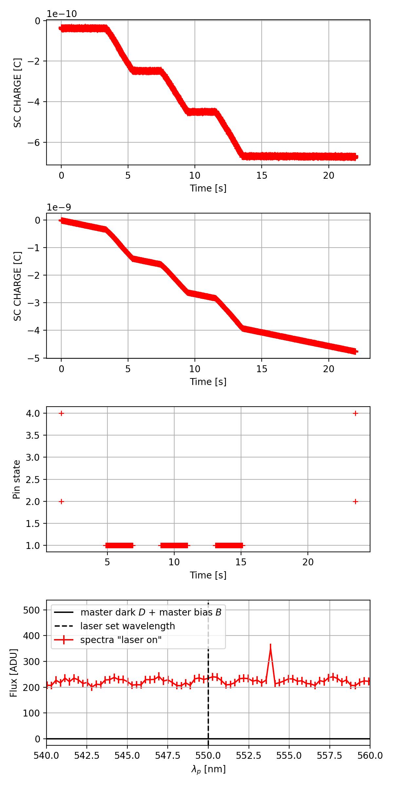
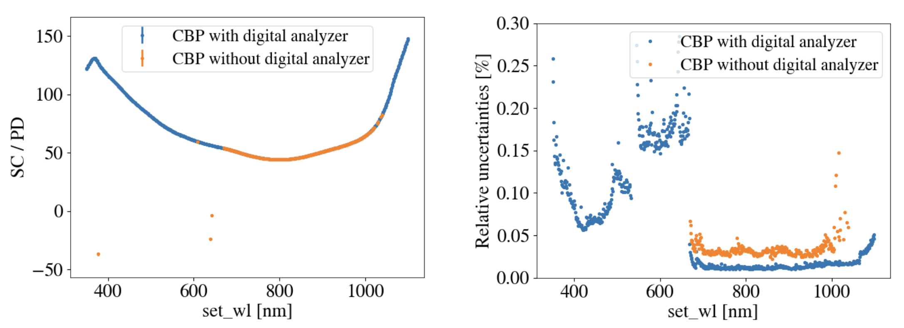

###################################################
Time Synchronization for the CBP Calibration System
###################################################

.. abstract::

   Description of the time synchronization protocol for the Collimated Beam Projector (CBP) calibration system.

Introduction
============

The Collimated Beam Projector (CBP) will be used to measure the wavelength-dependent throughput of the Simonyi telescope. We will project collimated laser bursts from the CBP located on the dome into the telescope. To know the intensity of the bursts impinging on the telescope, we must calibrate the CBP. A photodiode on the integrating sphere at the input to the CBP will allow us to measure the initial laser intensity, but we must then determine the CBP transmission to determine the intensity of the output beam.  We use the CBP calibration system to measure this intensity.

Details of the time synchronization problem
===========================================

The Setup

The integrating sphere mounted at the input to the CBP has three ports. One takes the laser fiber as input, another is the output port to the CBP, and the third holds a NIST calibrated photodiode which we use to measure the laser intensity. This photodiode is read out by a Keysight electrometer. The CBP is then aligned with the CBP calibration system, which contains a large lens and focuses the incident beam onto a photodiode. This photodiode is also read out by a Keysight electrometer.

Data Acquisition and Synchronization

During each sequence of series of bursts, both electrometers read out the charge accumulated due to the photodiode voltages. From this data, we can subtract off the background charge accumulation and find the amount of charge accumulated due to the laser bursts. This can be done through fits for laser wavelengths with high SNR, but for laser wavelengths with low SNR, determining the start and end of each burst through fitting these data traces alone is challenging. The electromters output a TTL signal at the start and end of each data trace, and the laser outputs a TTL signal each time it outputs a laser pulse. At LPNHE, the team uses a `logic timer <https://github.com/betoule/logic_timer/blob/main/README.md>`_, created by Marc Betoule, to sync up the start and end of the electrometer traces along with the laser bursts. This is done by connecting the TTL signals via BNC to the logic timer.

  
From top, (a) Keysight electrometer charge readout trace for the CBP photodiode at 450 nm. (b) Keysight electrometer charge readout trace for the calibration photodiode at 450 nm. (c) Pin states read out by the logic timer. Pin 1 is the laser TTL signal and the pin detects pulses in a burst. Pins 2 and 4 are for the CBP and CBP calibration photodiodes, respectively. (d) Spectrograph signal.

The logic timer allows for both a rescaling of internal clocks of the electrometers relative to each other and the laser and for finding the correct offsets in timing. Jeremy Neveu and others have found that the internal clock rescaling is stable over multiple weeks to within one part in :math:`10^{-4}`.

Implementing the logic timer setup directly on the Simonyi telescope will not work, because the CBP is located on the dome while the CBP calibration system is on the TMA, so directly running a cable between them is not viable. 

  
Time Synchronization Plan for Rubin
===================================

Some wavelengths have high enough SNR that the logic timer is not needed to find the fit. Jeremy Neveu provided the following analysis of the data at LPNHE with and without the logic timer (here the CBP calibration hardware used a solar cell, not a photodiode):

  
Left image: The ratio of the solar cell charge to the photodiode charge with fits done with and without the logic timer (or digital analyzer as it is sometimes called). Right image: percent relative uncertainties with and without the digital analyzer.

Without the logic timer, the data can only be analyzed in the wavelength range of ~669 to 1050 nm. However, within that range the uncertainties still tend to be well under a tenth of a percent. We intend to use these high SNR wavelengths to calibrate local Raspberry Pis and the find the rescaling factor of the electrometers.

The plan is to have Raspberry Pis at both the laser and CBP calibration electrometer (and possibly also the CBP electrometer) measure the timing of the laser pulses and readout traces and then use their internal clocks to do the synchronization at good wavelengths where it's unnecessary to use a logic timer. Then we'll use that synchronization to understand for all the other wavelengths. If the Rasberry Pi clocks are stable enough, then in a long scan we can choose our wavelength scan order such that we intersperse the high SNR wavelengths with low SNR wavelengths.

Tests and items we still need to do
===================================

1. Confirm that the Raspberry Pi clocks remain in relative sync for a sufficiently long time such that we don't have to repeat the measurement too frequently. Bench tests are being done for that.
2. Add the Raspberry Pis to our hardware setup.
3. Incorporate the Raspberry Pis into our data taking scheme.
4. Write analysis code for the Raspberry Pis.